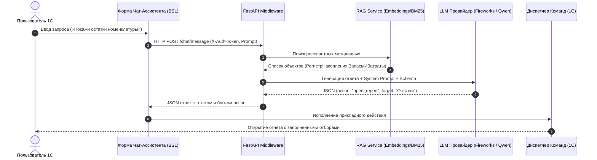
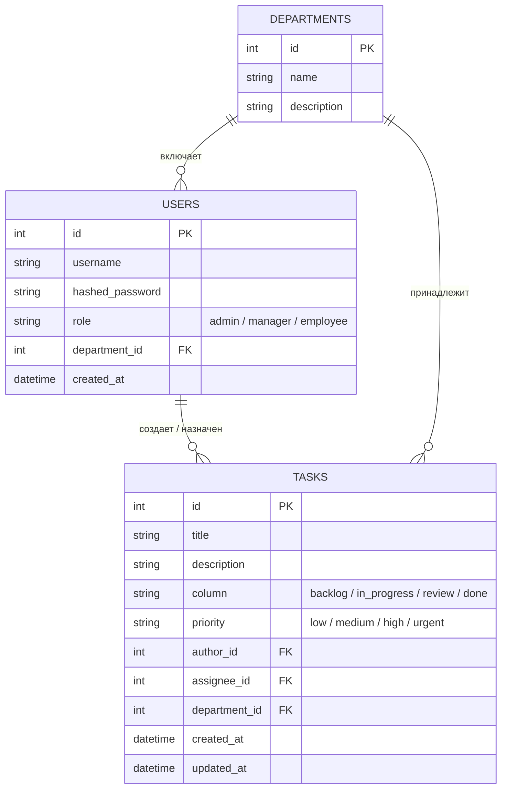

# Шаблоны архитектурных диаграмм Mermaid

---

## 1. Диаграмма последовательности: Обработка запроса пользователя

```mermaid
sequenceDiagram
    autonumber
    actor User as Пользователь 1С
    participant Form as Форма Чат-Ассистента (BSL)
    participant Mid as FastAPI Middleware
    participant RAG as RAG Service (Embeddings/BM25)
    participant LLM as LLM Провайдер (Fireworks / Qwen)
    participant Disp as Диспетчер Команд (1С)

    User->>Form: Ввод запроса («Покажи остатки номенклатуры»)
    Form->>Mid: HTTP POST /chat/message (X-Auth-Token, Prompt)
    Mid->>RAG: Поиск релевантных метаданных
    RAG-->>Mid: Список объектов (РегистрНакопления.ЗапасыИЗатраты)
    Mid->>LLM: Генерация ответа + System Prompt + Schema
    LLM-->>Mid: JSON (action: "open_report", target: "Остатки")
    Mid-->>Form: JSON ответ с текстом и блоком action
    Form->>Disp: Исполнение прикладного действия
    Disp-->>User: Открытие отчета с заполненными отборами
```

---

## 2. Диаграмма сущностей (ERD) канбан-доски

```mermaid
erDiagram
    USERS ||--o{ TASKS : "создает / назначен"
    DEPARTMENTS ||--o{ USERS : "включает"
    DEPARTMENTS ||--o{ TASKS : "принадлежит"

    USERS {
        int id PK
        string username
        string hashed_password
        string role "admin / manager / employee"
        int department_id FK
        datetime created_at
    }

    DEPARTMENTS {
        int id PK
        string name
        string description
    }

    TASKS {
        int id PK
        string title
        string description
        string column "backlog / in_progress / review / done"
        string priority "low / medium / high / urgent"
        int author_id FK
        int assignee_id FK
        int department_id FK
        datetime created_at
        datetime updated_at
    }
```
