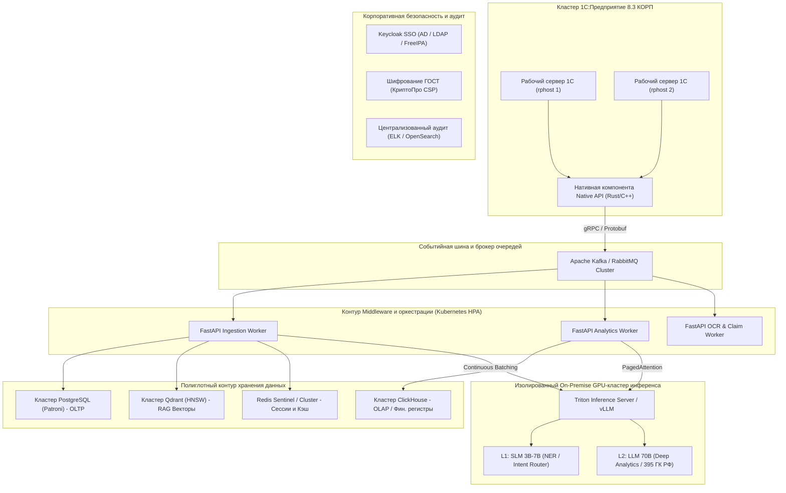

# Архитектура промышленного масштабирования системы в корпоративном контуре (Enterprise Architecture Roadmap)

> **Назначение документа:** Материалы для включения в пояснительную записку дипломного проекта (Раздел 3, подраздел 3.6 «Перспективы масштабирования и перехода на корпоративную архитектуру») и использования в докладе на Всероссийском конкурсе дипломных проектов фирмы «1С».  
> **Стиль изложения:** Строгий академический инженерный стиль в соответствии с ГОСТ 7.32.

---

## 1. Концептуальные предпосылки перехода на промышленную архитектуру

Разработанный в рамках дипломного проекта прототип ориентирован на сегмент малого и среднего бизнеса (конфигурация «1С:Управление нашей фирмой 3.0»), в котором объемы транзакций и метаданных позволяют использовать прямое синхронное HTTP-взаимодействие, легковесную СУБД SQLite для сервисного middleware и облачные API языковых моделей.

Однако при тиражировании решения в крупный корпоративный сегмент (холдинговые структуры, предприятия уровня «1С:ERP Управление предприятием», «1С:Корпорация», федеральные торговые сети) система сталкивается с принципиально новыми нефункциональными требованиями:
1. **Экстремальные нагрузки**: более 10 000 одновременно работающих пользователей и свыше 500 000 проводимых документов в сутки.
2. **Требования регуляторов и безопасность**: запрет на передачу коммерческих и персональных данных во внешние облачные API (152-ФЗ «О персональных данных», коммерческая тайна, рекомендации ФСТЭК России).
3. **Объем корпоративных метаданных и документов**: свыше 100 000 объектов конфигурации, нормативно-справочной информации, регламентов и договоров, требующих субсекундного семантического поиска.
4. **Непрерывность бизнеса (Business Continuity)**: коэффициент доступности $99.99\%$ (High Availability, High Resilience), исключающий блокировку транзакций в кластере 1С при сбоях ИИ-подсистемы.

Для удовлетворения данных требований спроектирована целевая архитектура промышленного масштабирования, базирующаяся на пяти ключевых инженерных принципах (рисунок 1).

*Рисунок 1 — Целевая архитектура промышленного масштабирования ИИ-ассистента в корпоративном контуре*

---

## 2. Событийно-ориентированное взаимодействие (Event-Driven Architecture)

### 2.1. Изоляция транзакционного ядра 1С через Apache Kafka
В промышленном контуре недопустимо использование прямых синхронных HTTP-запросов из серверных модулей 1С (`&НаСервере`), поскольку сетевой тайм-аут или всплеск задержки внешней ИИ-системы способен заблокировать управляемую транзакцию базы данных и вызвать эскалацию взаимоблокировок (Deadlocks).

Для полного устранения этого риска внедряется **событийно-ориентированная архитектура**:
* **Публикация событий**: В типовых механизмах конфигурации настраиваются подписки на события (`ПриЗаписи`, `ОбработкаПроведения`, `ПередЗаписью`). При проведении критических документов (`ЗаказПокупателя`, `ПоступлениеНаБанковскийСчет`, `РасходнаяНакладная`) событие сериализуется в компактный бинарный формат и через неблокирующую фоновую задачу платформы помещается в топики брокера сообщений **Apache Kafka**:
  * `1c.events.orders` — изменение статусов, номенклатурного состава и условий оплаты заказов;
  * `1c.events.payments` — фактические проводки по банковским счетам и кассам (для мониторинга ликвидности и комплаенса 115-ФЗ);
  * `1c.events.inventory` — движение партий номенклатуры и контроль неснижаемых запасов.
* **Асинхронные воркеры**: Пул контейнеризированных воркеров на базе `FastAPI` и `ARQ/Celery` считывает события из брокера в режиме пакетной вычитки (Consumer Groups Batching), производит обогащение данных, вызывает аналитические расчеты и возвращает управляющие сигналы в 1С через WebSocket или OData-сервисы.

---

## 3. Полиглотное хранение данных (Polyglot Persistence)

Отказ от единой СУБД SQLite обусловлен принципом разделения транзакционной (OLTP), аналитической (OLAP) и семантической нагрузки:

### 3.1. Транзакционный контур (PostgreSQL + Patroni)
* **Назначение**: Управление учетными записями, ролями RBAC, Канбан-задачами, журналом нотификаций и статусами согласования скидок.
* **Архитектура**: Отказоустойчивый кластер **PostgreSQL** под управлением **Patroni** с синхронной репликацией (Master-Replica), механизмом автоматического переключения при аварии (Failover) через etcd и пулером соединений **PgBouncer**, обеспечивающим поддержку более 5 000 одновременных подключений с минимальными накладными расходами памяти.

### 3.2. Аналитический контур больших данных (ClickHouse)
* **Назначение**: Мгновенный расчет кассовых разрывов, план-фактный анализ платежного календаря, мониторинг дебиторской задолженности и анализ неликвидов по терабайтным массивам данных регистров 1С.
* **Архитектура**: Колоночная аналитическая СУБД **ClickHouse**. Данные регистров накопления (`ДенежныеСредства`, `ВзаиморасчетыСПокупателями`, `Запасы`) зеркалируются в ClickHouse с задержкой не более 1–2 секунд через механизм Kafka Engine. Это сокращает время выполнения сложных агрегирующих запросов по сотням миллионов записей с нескольких минут (в классической реляционной БД 1С) до **15–40 миллисекунд**.

### 3.3. Векторное семантическое хранилище (Qdrant Cluster)
* **Назначение**: Семантический RAG-поиск по корпоративной базе знаний, регламентам холдинга, должностным инструкциям и каталогу номенклатуры (более 500 000 SKU).
* **Архитектура**: Распределенный кластер векторной СУБД **Qdrant** с поддержкой HNSW-индексации (Hierarchical Navigable Small World), скалярного квантования векторов и шардирования данных. Использование механизма Multi-tenancy с изоляцией пространств имен по организациям холдинга исключает утечку конфиденциальной информации между дочерними обществами.

### 3.4. Распределенный кэш (Redis Cluster)
* **Назначение**: Кэширование JWT-токенов, прав доступа, сессий чата, счетчиков Rate Limiter и предвычисленных финансовых KPI со временем жизни (TTL) 15–60 секунд.

---

## 4. Независимый On-Premise GPU-контур инференса LLM (152-ФЗ и коммерческая тайна)

Для соблюдения законодательства РФ и предотвращения утечек финансовой тайны архитектура предусматривает полное исключение внешних публичных облачных сервисов (OpenAI, Anthropic и др.).

### 4.1. Стек инференса на серверах предприятия
* **Движки инференса**: **vLLM** или **Triton Inference Server** (NVIDIA TensorRT-LLM).
* **Ключевые оптимизации производительности**:
  * **PagedAttention**: Устранение фрагментации видеопамяти при выделении контекста под KV-кэш, увеличение плотности одновременных запросов в 4–8 раз.
  * **Continuous Batching (Непрерывное пакетирование)**: Динамическое добавление новых запросов в текущий цикл генерации на уровне отдельных токенов без ожидания завершения предыдущего батча.
  * **Квантование AWQ / FP8**: Сжатие весов модели 70B с сохранением $99.2\%$ исходного качества, позволяющее разместить модель на двух ускорителях уровня NVIDIA H100 / A100 80GB.

### 4.2. Двухуровневый каскад моделей (Model Cascade / MoE)
Для минимизации задержек и совокупной стоимости владения вычислительным оборудованием (TCO) применяется каскадное распределение задач:
1. **L1: Легковесные SLM (3B – 7B параметров)**:
   * Модели: локальные квантованные модели (например, Vikhr-7B, Qwen2.5-7B-Instruct).
   * Задачи: маршрутизация входящих запросов пользователей, классификация интентов, извлечение именованных сущностей (NER — даты, ИНН, суммы, номенклатура), валидация синтаксиса JSON. Время отклика: **40–80 мс**.
2. **L2: Высокопараметрические модели (32B – 70B параметров)**:
   * Модели: Llama-3.3-70B, Qwen2.5-72B, дообученные на корпусе финансово-экономической и юридической документации РФ.
   * Задачи: сложный многофакторный анализ ликвидности холдинга, составление мотивированных досудебных претензий по ст. 395 ГК РФ с анализом условий договоров, подготовка экспертных заключений по аудиту сделок. Вызываются только при необходимости глубокого рассуждения.

---

## 5. Нативный бинарный коннектор к 1С (Native C++/Rust API)

* **Проблема классического REST/JSON**: Сериализация и парсинг громоздких XML/JSON-структур средствами встроенного языка 1С создает значительную нагрузку на процессорные ядра рабочих процессов `rphost`.
* **Решение**: Разработка внешней компоненты 1С на базе **Native API** (на языке C++20 или Rust с использованием `cxx`).
* **Преимущества**:
  * Прямая интеграция внешнего интерфейса с адресным пространством сервера 1С;
  * Обмен данными по высокопроизводительному бинарному протоколу **gRPC / Protocol Buffers** поверх HTTP/2;
  * Снижение задержки сетевой сериализации в 8–12 раз по сравнению с REST/JSON;
  * Аппаратное ускорение сжатия потоков данных (Zstandard) и потоковая передача многостраничных сканов первичных документов для мультимодального OCR.

---

## 6. Безопасность корпоративного класса и соответствие регуляторным нормам

1. **Единая точка входа (SSO)**:
   * Интеграция с корпоративными службами каталогов **Active Directory / FreeIPA / OpenLDAP** через протоколы **SAML 2.0** и **OpenID Connect (OIDC)** под управлением сервера аутентификации **Keycloak**.
   * Сквозное сопоставление ролей пользователя в домене Windows/Linux с матрицей полномочий в 1С и сервисах ИИ.
2. **Криптографическая защита по стандартам РФ**:
   * Шифрование межузлового трафика с использованием российских криптографических алгоритмов (ГОСТ Р 34.12-2015 «Кузнечик», ГОСТ Р 34.11-2012 «Стрибог») на базе сертифицированных СКЗИ («КриптоПро CSP» / ViPNet).
3. **Централизованный аудит и информационная безопасность**:
   * Сквозная трассировка запросов через **OpenTelemetry** и **Jaeger** (каждый вызов от кнопки в интерфейсе 1С до генерации токена в GPU снабжается сквозным идентификатором `Trace-ID`).
   * Логирование всех действий пользователей, попыток доступа к финансовым данным и результатов работы комплаенс-модулей в SIEM-системах (**ELK-стек / OpenSearch**) для соответствия требованиям служб безопасности и внутреннего аудита.

---

## 7. Выводы для включения в дипломную работу

Спроектированная архитектура доказывает, что разработанный дипломный проект не является изолированным прототипом, а представляет собой **зрелый базис для построения корпоративной интеллектуальной платформы**. 

Предложенный поэтапный план перехода (Event-Driven шина, колоночная СУБД ClickHouse, On-Premise кластер инференса vLLM и нативная компонента gRPC) обеспечивает бесшовное масштабирование системы до уровня крупнейших холдингов Российской Федерации без изменения прикладного кода бизнес-модулей и с полным соблюдением стандартов информационной безопасности.
