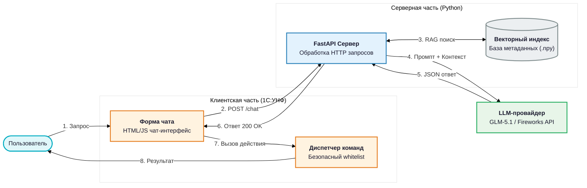
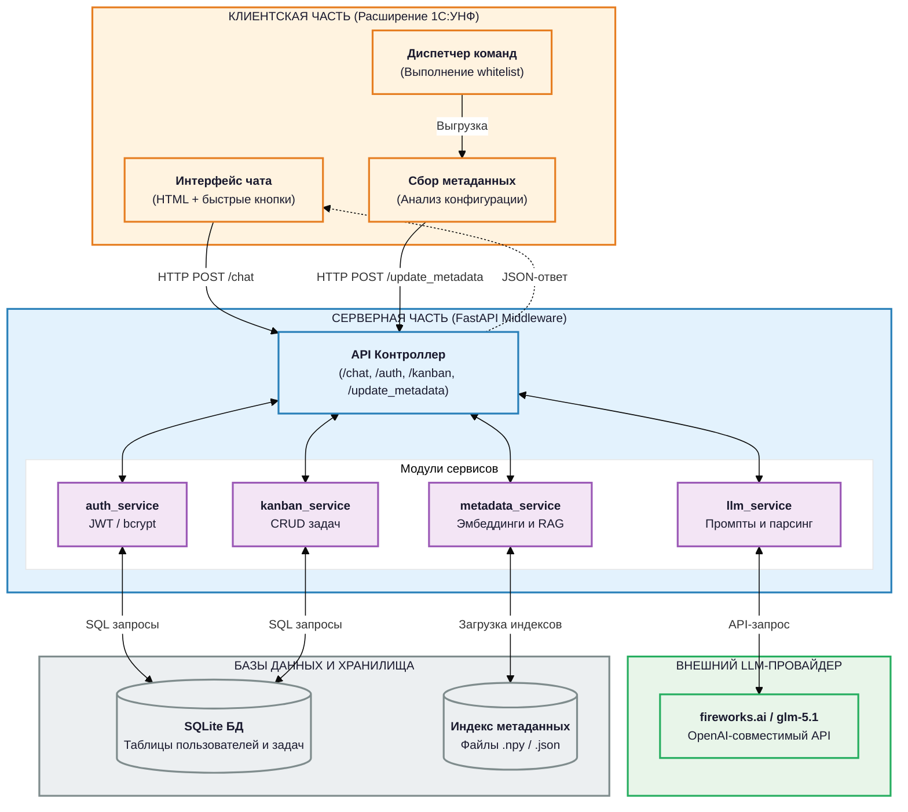
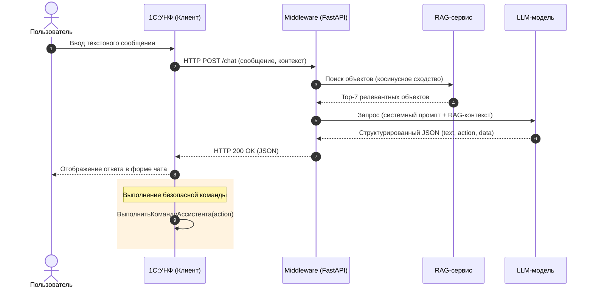
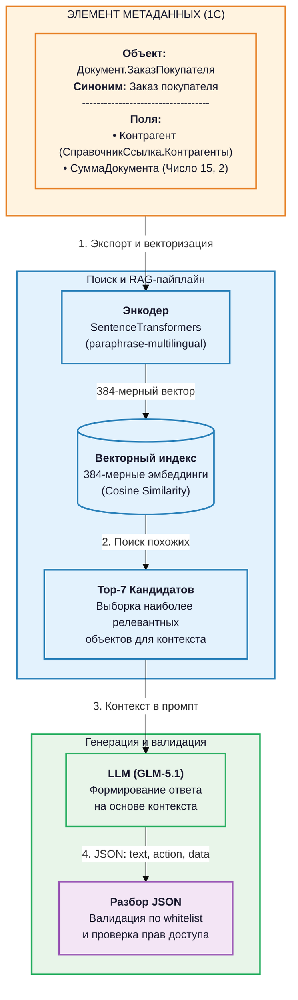
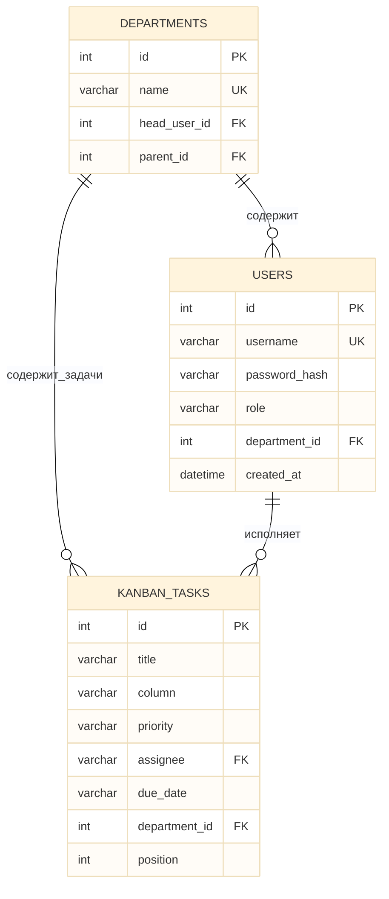
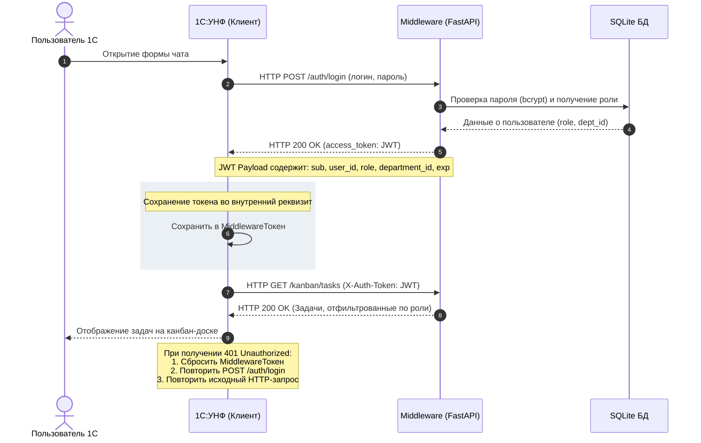
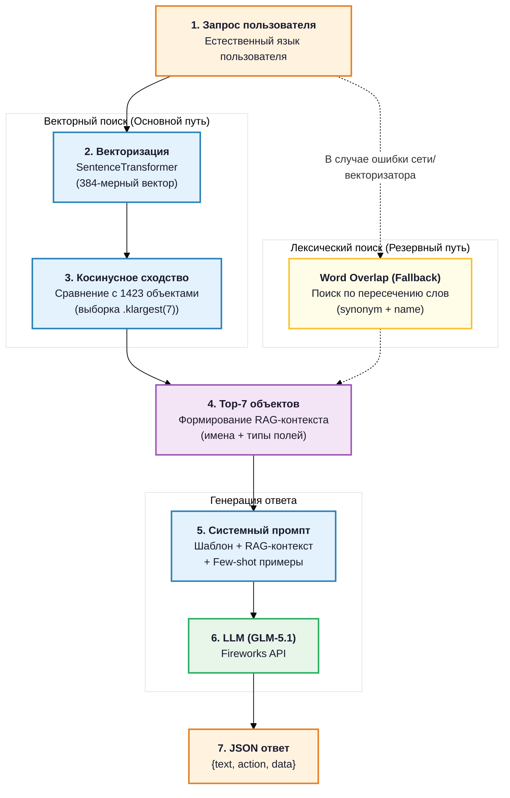

# Оптимизированные диаграммы Mermaid.js для диплома

В данном документе собраны доработанные и оптимизированные версии Mermaid.js для всех 6 диаграмм категории 1. В этих версиях устранены проблемы с читаемостью текста:
- Использована иерархия шрифтов (жирный заголовок `<b>` + обычный текст).
- Текст внутри блоков аккуратно разбит на строки с помощью ` `.
- Подписи на стрелках сокращены и структурированы, чтобы избежать наложения.
- Для каждого элемента задан правильный цвет обводки и заливки согласно правилам оформления диплома (`00_common_rules.txt`).

---

### Рисунок 1.1 — Место интеллектуального ассистента в контуре работы пользователей 1С:УНФ

---

### Рисунок 2.1 — Архитектура решения: компоненты и взаимосвязи

---

### Рисунок 2.2 — Диаграмма последовательностей «Отправка сообщения»

---

### Рисунок 2.3 — Структура элемента метаданных и место в процессе RAG

---

### Рисунок 2.4 — ER-диаграмма базы данных SQLite

---

### Рисунок 2.6 — Схема JWT-авторизации между 1С и middleware

---

### Рисунок 3.2 — Схема RAG: от запроса пользователя к структурированному ответу

